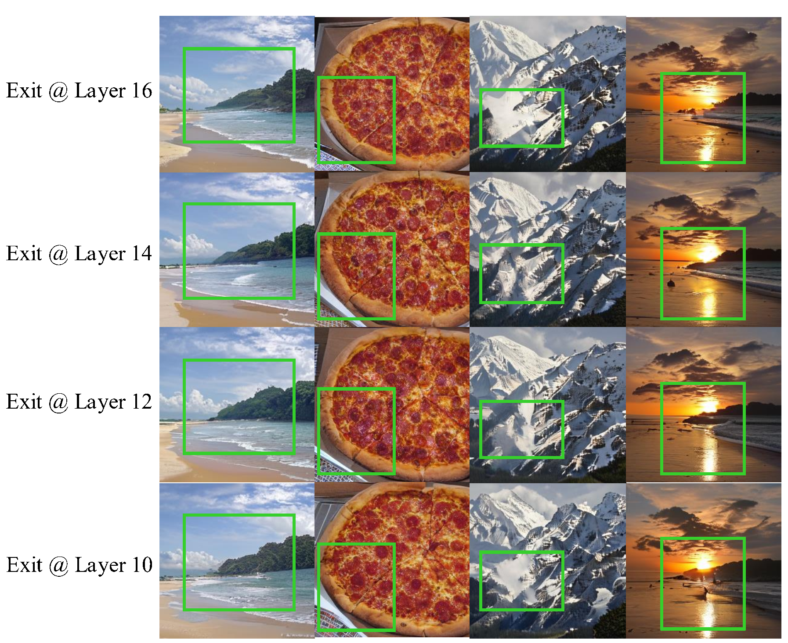

📝 This repository accompanies our **NeurIPS 2025 submission**

# FreqExit: Enabling Early-Exit Inference for Visual Autoregressive Models via Frequency-Aware Guidance

## 🧠 Abstract

FreqExit is a dynamic inference framework for Visual AutoRegressive (VAR) models, which decode from coarse structures to fine details. Existing methods fail on VAR due to the absence of semantic stability and smooth representation transitions. FreqExit addresses this by recognizing that high-frequency details essential to visual quality tend to emerge in later decoding stages. On ImageNet 256×256, FreqExit achieves up to **2×** speedup with only minor degradation, and delivers **1.3×** acceleration without perceptible quality loss. This enables runtime-adaptive acceleration within a unified model, offering a favorable trade-off between efficiency and fidelity for practical and flexible deployment.

---

<p align="center">
  
</p>
<p align="center"><em>FreqExit bridges step-wise generation and early-exit acceleration, achieving up to <strong>2×</strong> speedup with minimal quality loss.</em></p>

## ✨ What's New?

**FreqExit** is the first dynamic inference framework designed specifically for next-scale visual autoregressive (VAR) models. It introduces a frequency-aware training paradigm that bridges the gap between step-wise generation and early-exit acceleration, enabling runtime-adaptive inference without architectural changes.

The framework enhances learning through two novel training-time strategies that improve feature stability and spectral quality, all without adding inference-time overhead.

---

Extensive experiments on ImageNet 256×256 demonstrate up to **2×** speedup with minimal quality degradation, surpassing state-of-the-art dynamic and speculative inference baselines.

<p align="center">
  
</p>
<p align="center"><em>Figure: FreqExit achieves superior speed–quality trade-off compared to baseline dynamic inference methods.</em></p>


## 🧩 Method
The FreqExit framework introduces frequency-aware guidance to enable dynamic inference in Visual AutoRegressive models. It consists of three core components:

Curriculum-Based Early-Exit Supervision: Integrates layer-adaptive dropout and progressive early-exit loss to encourage expressive representations in shallow layers under a dynamic supervision schedule.

High-Frequency Consistency Loss: Aligns spectral content across generation steps in the wavelet domain, stabilizing high-frequency learning without disrupting early training behavior.

Frequency-Gated Self-Reconstruction: Adds an auxiliary loss branch with learnable sub-band gates to guide frequency-aware spectral learning, improving convergence and generation quality.

<p align="center">  </p> <p align="center"><em> Overview of the FreqExit framework with three components enabling frequency-aware dynamic inference.</em></p>

## ⚙️ Installation
To get started, clone the repository and install the required dependencies:

```bash
cd FreqExit
pip install -r requirements.txt
```

## 🚀 Running the Code
### Training
```bash
torchrun --nproc_per_node=8 train.py \
  --bs=1024 \
  --ep=80 \
  --tblr=1e-5 \
  --alng=1e-4 \
  --twd=0 \
  --twde=0 \
  --data_path=path_to_your_imagenet
```
📌 --nproc_per_node controls the number of GPUs used. Modify as needed.

### Evaluation
🔹 Evaluate dynamic inference with early exit:
```bash
python infer_freqexit.py \
  --model_depth 20 \
  --pn 256 \
  --exit_config 1 \
  --fid_output_dir samples_config
```
📌 --exit_config specifies the early-exit path index. You can freely customize different exit routes based on task needs.

🔹 Zero-shot inpainting evaluation:
```bash
 python infer_inpaint.py \
  --model_depth 20 \
  --input_image path_to_your_image.jpg \
  --output_image repaired_image.png \
  --mask_type rectangle \
  --output_dir ./inpaint_results
```

## 📊 Experimental Results
We evaluate FreqExit on ImageNet 256×256 against state-of-the-art dynamic inference methods. It achieves significantly better efficiency–quality trade-offs.
<p align="center">
  
</p>
<p align="center"><em>Table 1: FreqExit outperforms prior methods in both perceptual quality and runtime efficiency.</em></p>

---

### 🖼️ Zero-shot Inpainting Results

FreqExit also shows strong generalization in a zero-shot inpainting setting without any task-specific fine-tuning.

<p align="center">
  
</p>
<p align="center"><em>Visual examples of FreqExit reconstructing masked regions with semantically coherent details.</em></p>


