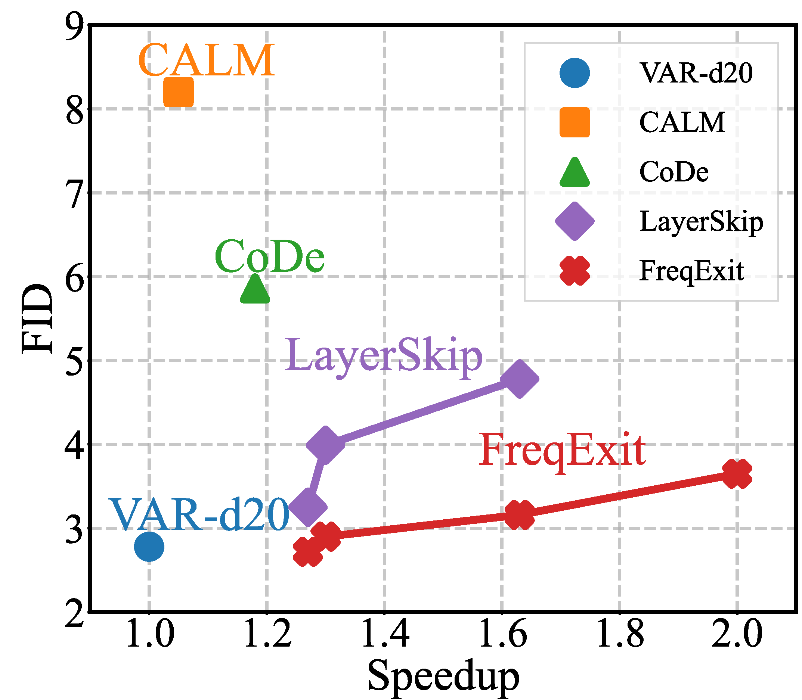

<!-- ===== Fonts & minimal style (works on GitHub Pages) ===== -->
<link rel="preconnect" href="https://fonts.googleapis.com">
<link href="https://fonts.googleapis.com/css2?family=Inter:wght@400;600;800&display=swap" rel="stylesheet">
<style>
  :root{
    --text:#1f2328; --muted:#57606a; --accent:#1f6feb; --pill:#2f363d; --gold:#d4a72c;
    --maxw:1100px;
  }
  body{font-family:"Inter",-apple-system,BlinkMacSystemFont,"Segoe UI",Roboto,Helvetica,Arial,"Apple Color Emoji","Segoe UI Emoji";}
  .wrap{max-width:var(--maxw); margin:0 auto; padding:24px 16px 48px;}
  .title{font-size:44px; font-weight:800; line-height:1.15; text-align:center; color:var(--text); margin:18px 0 8px;}
  .venue{font-size:22px; font-weight:700; color:#d12; text-align:center; margin:4px 0 18px;}
  .authors,.affils{ text-align:center; color:var(--muted); }
  .authors a{ color:#0969da; text-decoration:none; }
  .authors a:hover{ text-decoration:underline; }
  sup{font-size:.75em}
  .badges{ text-align:center; margin:26px 0 20px;}
  .badge{
    display:inline-block; margin:6px 8px; padding:10px 14px; border-radius:14px;
    background:var(--pill); color:#fff; font-weight:700; letter-spacing:.3px;
    text-decoration:none; box-shadow:0 2px 6px rgba(0,0,0,.12);
  }
  .badge.blue{ background:var(--accent);}
  .badge.gold{ background:var(--gold); color:#1f2328;}
  .section{max-width:var(--maxw); margin:28px auto 0; }
  .section h2{margin-top:22px}
  .center{ text-align:center;}
  img.hero{max-width:760px; width:100%; border-radius:10px; box-shadow:0 8px 24px rgba(0,0,0,.08);}
  .logos{display:flex; justify-content:center; align-items:center; gap:36px; margin:22px 0 30px;}
  .logos img{height:70px; width:auto;}
</style>

<div class="wrap">

  <h1 class="title">FreqExit: Enabling Early-Exit Inference for Visual Autoregressive Models via Frequency-Aware Guidance</h1>
  <div class="venue">NeurIPS 2025</div>

  <div class="authors">
    <a>Ying Li</a><sup>1</sup>,
    <a>Chengfei Lv</a><sup>2</sup>,
    <a>Huan Wang</a><sup>1</sup>
  </div>

  <div class="affils">
    <sup>1</sup> Westlake University &nbsp;&nbsp;·&nbsp;&nbsp;
    <sup>2</sup> Alibaba Group
  </div>

  <div class="center" style="margin-top:6px;">
    <em>*Corresponding author: wanghuan [at] westlake [dot] edu [dot] cn</em>
  </div>

  <div class="logos">
    
    
  </div>

  <div class="badges">
    <a class="badge blue" href="https://github.com/NeuraLiying/FreqExit">Code</a>
    <a class="badge gold" href="https://opensource.org/license/apache-2-0">Apache&nbsp;2.0</a>
  </div>

  <div class="center">
    
    <p><em>FreqExit bridges step-wise generation and early-exit acceleration, achieving up to <strong>2×</strong> speedup with negligible quality degradation.</em></p>
  </div>

  ## Abstract
  FreqExit is a dynamic inference framework for Visual AutoRegressive (VAR) models, which decode from coarse structures to fine details. Existing methods fail on VAR due to the absence of semantic stability and smooth representation transitions. FreqExit addresses this by recognizing that high-frequency details essential to visual quality tend to emerge in later decoding stages. On ImageNet 256×256, FreqExit achieves up to **2×** speedup with only minor degradation, and delivers **1.3×** acceleration without perceptible quality loss. This enables runtime-adaptive acceleration within a unified model, offering a favorable trade-off between efficiency and fidelity for practical and flexible deployment.

  ## Results (Teaser)
  <p class="center"></p>

  ## Acknowledgement
  This work builds upon the foundations of prior open-source efforts,
  including <a href="https://github.com/FoundationVision/VAR">VAR</a>,
  <a href="https://github.com/czg1225/CoDe">CoDe</a>, and
  <a href="https://github.com/facebookresearch/LayerSkip">LayerSkip</a>.
  We sincerely thank the authors for their excellent contributions to the research community.

  ## BibTeX
  ```bibtex
  @inproceedings{li2025freqexit,
    title={FreqExit: Enabling Early-Exit Inference for Visual Autoregressive Models via Frequency-Aware Guidance},
    author={Li, Ying and Lv, Chengfei and Wang, Huan},
    booktitle={NeurIPS},
    year={2025}
  }
</div>
