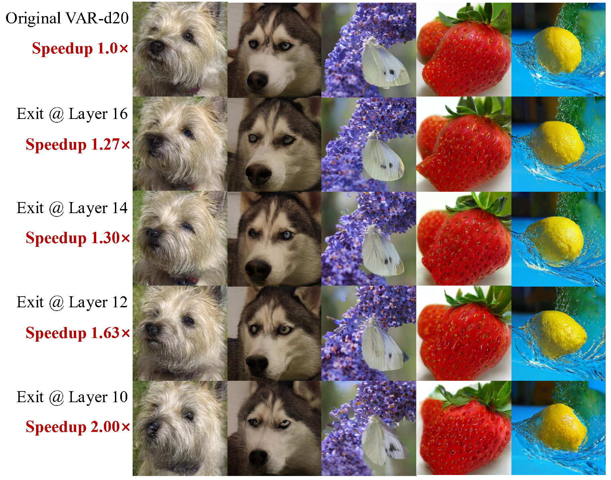

<!-- ===== Fonts & minimal style (works on GitHub Pages) ===== -->
<link rel="preconnect" href="https://fonts.googleapis.com">
<link href="https://fonts.googleapis.com/css2?family=Inter:wght@400;600;800&display=swap" rel="stylesheet">

  <h1 class="title">FreqExit: Enabling Early-Exit Inference for Visual Autoregressive Models via Frequency-Aware Guidance</h1>
  
NeurIPS 2025

  

    <a>Ying Li</a>1,
    <a href="https://openreview.net/profile?id=~chengfei_lv1" target="_blank">Chengfei Lv</a>2,
    <a href="https://huanwang.tech/" target="_blank">Huan Wang</a>1
  

  

    1 Westlake University &nbsp;&nbsp;·&nbsp;&nbsp;
    2 Alibaba Group
  

  

    <em>*Corresponding author: wanghuan [at] westlake [dot] edu [dot] cn</em>
  

  

    
    
  

  

    <a class="badge blue" href="https://github.com/NeuraLiying/FreqExit">Code</a>
    <a class="badge gold" href="https://opensource.org/license/apache-2-0">Apache&nbsp;2.0</a>
  

  

    
    
<em>FreqExit bridges step-wise generation and early-exit acceleration, achieving up to <strong>2×</strong> speedup with negligible quality degradation.</em>

  

  <!-- ===== Sections written in pure HTML so they always render correctly ===== -->
  

    <h2>Abstract</h2>
    

      FreqExit is a dynamic inference framework for Visual AutoRegressive (VAR) models, which decode from coarse
      structures to fine details. Existing methods fail on VAR due to the absence of semantic stability and smooth
      representation transitions. FreqExit addresses this by recognizing that high-frequency details essential to
      visual quality tend to emerge in later decoding stages. On ImageNet 256×256, FreqExit achieves up to
      <b>2×</b> speedup with only minor degradation, and delivers <b>1.3×</b> acceleration without perceptible quality
      loss. This enables runtime-adaptive acceleration within a unified model, offering a favorable trade-off between
      efficiency and fidelity for practical and flexible deployment.
    

  

  

    <h2>Overview of our FreqExit method</h2>
    

      
    

  

  

    <h2>Main Results</h2>
    

      

        

          
        

        

          
        

      

    

    

      
      
    

  

  

    <h2>More Visualizations</h2>
    

      

        

          
        

        

          
        

      

    

    

      
      
    

  

  

    <h2>Acknowledgement</h2>
    

      This work builds upon the foundations of prior open-source efforts,
      including <a href="https://github.com/FoundationVision/VAR">VAR</a>,
      <a href="https://github.com/czg1225/CoDe">CoDe</a>, and
      <a href="https://github.com/facebookresearch/LayerSkip">LayerSkip</a>.
      We sincerely thank the authors for their excellent contributions to the research community.
    

  

  

    <h2>BibTeX</h2>
    <pre><code class="language-bibtex">@inproceedings{li2025freqexit,
  title={FreqExit: Enabling Early-Exit Inference for Visual Autoregressive Models via Frequency-Aware Guidance},
  author={Li, Ying and Lv, Chengfei and Wang, Huan},
  booktitle={NeurIPS},
  year={2025}
}</code></pre>
  

 <!-- /wrap -->

